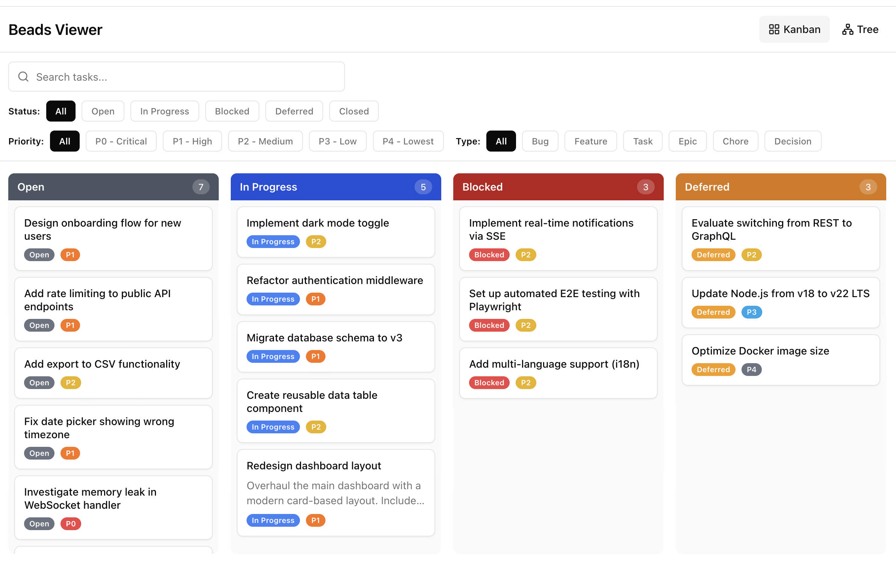
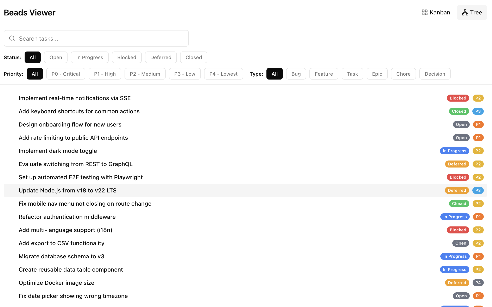

# Beads Viewer

A local web application for viewing and managing [beads](https://github.com/steveyegge/beads/) tasks. Browse to any project directory with a `.beads/` folder and interact with your issues through a kanban board or tree view.

## Screenshots

### Kanban View
Drag-and-drop tasks between status columns (Open, In Progress, Blocked, Deferred, Closed).



### Tree View
A flat list with status and priority badges, filterable by any combination of criteria.



## Features

- **Kanban board** with drag-and-drop to change task status
- **Tree view** for a compact list of all tasks
- **Filtering** by status, priority, type, labels, and free-text search
- **Task editing** via a detail dialog (title, description, status, priority, type, labels, assignee, due date, notes)
- **Directory picker** to switch between beads projects
- **Persists** last-used directory in localStorage

## Prerequisites

- [Node.js](https://nodejs.org/) v18+
- [beads](https://github.com/steveyegge/beads/) CLI (`bd`) installed and on your PATH
- At least one project with `bd init` already run

## Getting Started

```bash
# Clone the repo
git clone https://github.com/jeremyconkin/BeadsViewer.git
cd BeadsViewer

# Install dependencies
npm install

# Start the dev server
npm run dev
```

Open [http://localhost:3000](http://localhost:3000), paste the path to a beads-enabled project directory, and click **Open**.

## Tech Stack

| Layer | Technology |
|-------|-----------|
| Framework | Next.js 14 (App Router) |
| Language | TypeScript |
| UI | shadcn/ui (Radix + Tailwind CSS) |
| Drag & Drop | react-dnd |
| Icons | lucide-react |
| Toasts | sonner |
| Backend | Next.js API routes shelling out to `bd` CLI |

## How It Works

The app runs a local Next.js server. API routes execute `bd list --json`, `bd show`, and `bd update` commands against the selected project directory. The frontend reads the JSON output and renders it in the chosen view.

## License

MIT
